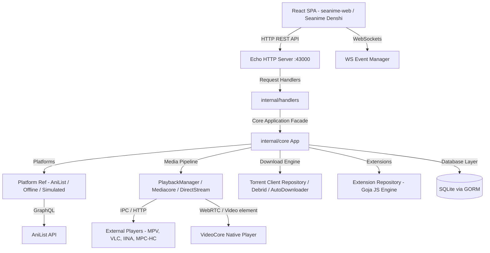
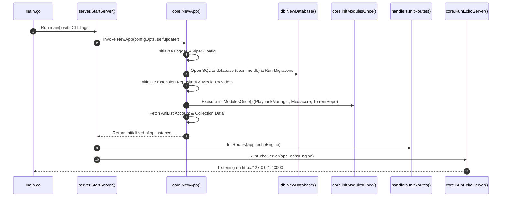
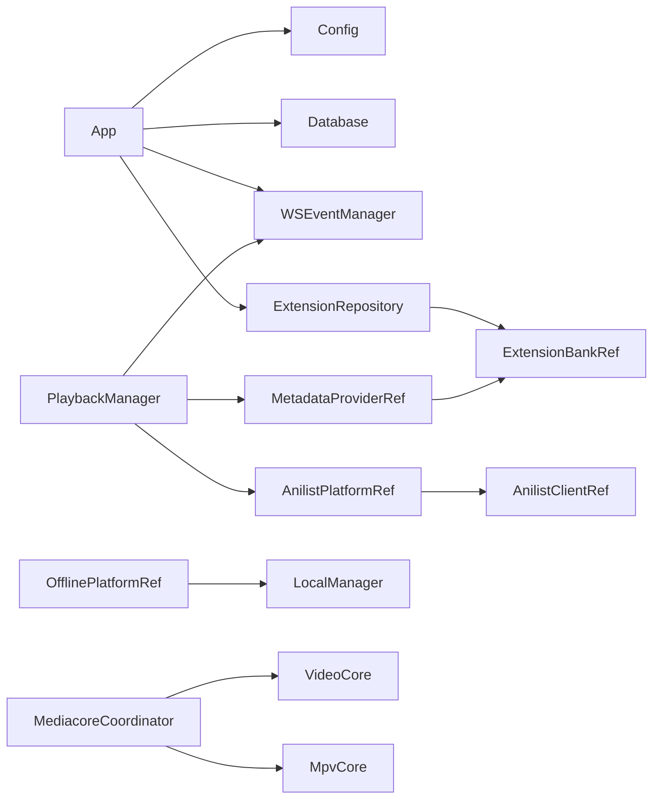
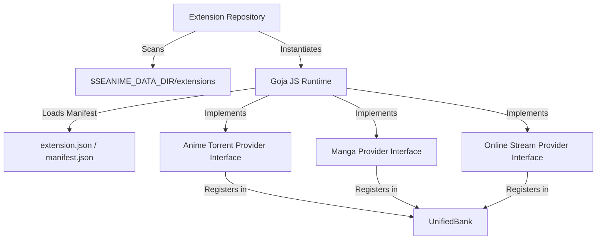
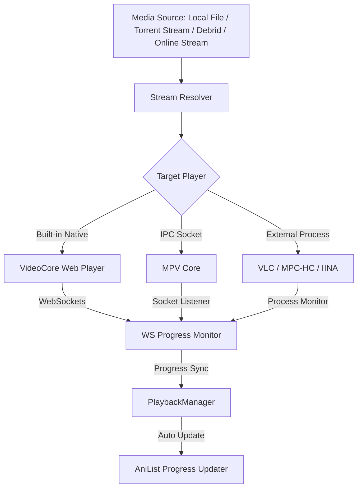
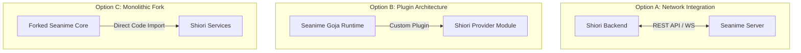
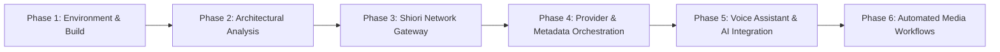

# Seanime Architecture & System Analysis

> **Document Purpose**: Single source of truth for Seanime's backend and frontend architecture, core initialization workflows, dependency graph, extension system, and Shiori integration strategy.

---

## 1. Project Overview

**Seanime** is a self-hosted, desktop-first personal media server and anime management ecosystem written in **Go** and **React (TypeScript)**. 

### Main Purpose
Seanime acts as an intelligent media orchestration node that bridges public tracking platforms (AniList) with local media libraries, torrent downloading engines (BitTorrent/Debrid/Transmission/qBittorrent), streaming providers, and local media playback engines (VideoCore, MPV, VLC, MPC-HC, IINA).

### Target Users
- Anime enthusiasts who maintain offline collections or stream via BitTorrent / Debrid / online providers.
- Users desiring high-performance, single-binary media management with real-time UI status and tracking sync.

### Major Capabilities
- **AniList Sync & Metadata Engine**: Bidirectional synchronization of anime/manga watch state, scoring, collection tracking, and progress.
- **Local Media Scanner & Parsers**: High-speed parsing of video files using the `habari` filename parser and MKV metadata extractors.
- **Unified Media Resolution Pipeline**: Streaming from torrents, direct HTTP, online stream providers, or local files directly to built-in or external players.
- **Extensible Plugin / Extension Architecture**: Embedded JavaScript engine powered by **Goja**, allowing community-written providers for anime torrents, manga, online streams, and custom sources.
- **Download Automation & Management**: Built-in BitTorrent engine (`anacrolix/torrent`), Debrid API integration, torrent client RPC wrappers (qBittorrent, Transmission), and auto-downloading rule engines.
- **Desktop & Offline Compatibility**: Support for desktop sidecar deployment (Seanime Denshi) and standalone offline operation via cached assets and local platform fallbacks.

---

## 2. High Level Architecture

Seanime is structured as a **modular monolith** executing in a single Go process, serving a modern React single-page application (SPA) embedded directly in the binary or proxied during development.



### Flow Breakdown
1. **Frontend Presentation**: The React client communicates with the server via HTTP REST endpoints (`/api/v1/...`) and maintains a persistent WebSocket connection (`/events`) for instant state updates.
2. **HTTP Gateway (Echo)**: Echo routes requests through security middleware (CORS, HMAC validation, password checks, TLS) to target handlers.
3. **Core Orchestrator (`App` Struct)**: The central facade object (`internal/core/app.go`) holds thread-safe references (`util.Ref[T]`) to active platforms, databases, file caches, and execution banks.
4. **Services & Repositories**: Subsystems execute domain-specific logic (e.g. `library/scanner` for file indexing, `onlinestream` for episode fetching, `torrentstream` for sequential BitTorrent playback).
5. **Persistence**: GORM manages local metadata, user settings, offline progress, and provider state inside an SQLite database (`seanime.db`).

---

## 3. Repository Structure

```
seanime/
├── main.go                     # Application entrypoint
├── go.mod / go.sum             # Go module definition and dependencies
├── DEVELOPMENT_AND_BUILD.md    # Developer guidelines and build steps
├── codegen/                    # Code generator for TypeScript type bindings and test fixtures
├── docs/                       # Project assets and developer guides
├── mobile/                     # Experimental mobile components
├── test/                       # End-to-end and mock test suites
├── seanime-denshi/             # Electron/Chromium desktop wrapper with extended codec support
├── seanime-web/                # React + Vite + TanStack Router frontend SPA
└── internal/                   # Core server implementation packages (53 subdirectories)
    ├── api/                    # External API wrappers (AniList GraphQL, Metadata providers)
    ├── constants/              # System constants and build versioning
    ├── continuity/             # Watch state & playback continuity tracker
    ├── core/                   # Core application bootstrapper, config, & module assembly
    ├── database/               # SQLite GORM database connection, models, & migrations
    ├── debrid/                 # Real-Debrid / Torbox / Debrid-Link API integrations
    ├── directstream/           # HLS & HTTP Direct Video Stream Transcoder/Packager
    ├── discordrpc/             # Discord Rich Presence integration
    ├── events/                 # Real-time WebSocket event dispatcher
    ├── extension/              # Extension type definitions, UnifiedBank, & JS abstractions
    ├── extension_repo/         # External & built-in extension loader & repository
    ├── goja/                   # Embedded Goja JS execution runtime
    ├── handlers/               # Echo HTTP endpoints and controller logic
    ├── hook/                   # Plugin hook registration and event manager
    ├── library/                # Anime scanner, filler manager, auto-downloader, playback manager
    ├── manga/                  # Manga repository, chapter reader, & downloader
    ├── mediacore/              # Unified player coordinator (VideoCore & MPVCore)
    ├── mediaplayers/           # Interprocess communications for VLC, MPCH-HC, IINA, MPV
    ├── mediastream/            # Media transcode and HLS stream server
    ├── mpvcore/                # Native MPV socket wrapper
    ├── nativeplayer/           # Built-in native player protocol handler
    ├── onlinestream/           # Online stream extraction service
    ├── platforms/              # Platform abstraction (AniList, Offline, Simulated)
    ├── security/               # Request boundary, password hashing, and HMAC verification
    ├── server/                 # Echo server setup and lifecycle management
    ├── torrent_clients/        # BitTorrent client wrappers (Built-in, qBittorrent, Transmission)
    ├── torrents/               # Torrent search, auto-selection, & availability monitor
    ├── torrentstream/          # Sequential BitTorrent video streaming engine
    ├── updater/                # Auto-updater and GitHub release fetcher
    ├── user/                   # User session struct & simulated account management
    ├── util/                   # File cache, logging, result mapping, thread-safe references
    └── videocore/              # Embedded video player core
```

---

## 4. Core Folder Analysis (`internal/core/`)

The `internal/core/` package forms the backbone of Seanime. Below is the file-by-file breakdown of every source file:

### 1. `app.go`
- **Purpose**: Defines the central `App` struct and constructor `NewApp()`.
- **Responsibilities**:
  - Acts as the primary dependency injection container.
  - Instantiates logging, configuration, database connection, file cachers, and WebSocket managers.
  - Initializes references (`util.Ref`) for platforms, metadata providers, and extension banks.
  - Manages cleanup callbacks (`Cleanups []func()`) for graceful shutdown.

### 2. `modules.go`
- **Purpose**: Assembles application sub-modules during startup and settings updates.
- **Responsibilities**:
  - `initModulesOnce()`: Initializes single-instance services (FillerManager, ContinuityManager, PlaybackManager, VideoCore, MpvCore, MediacoreCoordinator, MangaDownloader).
  - `InitOrRefreshModules()`: Re-hydrates settings-dependent modules (TorrentClientRepository, MediaPlayerRepository, DiscordPresence, AutoScanner, AutoDownloader) whenever configuration changes.

### 3. `extensions.go`
- **Purpose**: Extension loading wrapper functions.
- **Responsibilities**:
  - `LoadCustomSourceExtensions()`: Loads custom source JS extensions prior to AniList initialization.
  - `LoadExtensions()`: Loads built-in providers (e.g. Local Manga) and registers external JS extensions asynchronously.

### 4. `echo.go`
- **Purpose**: Echo web server instance creation and static asset routing.
- **Responsibilities**:
  - `NewEchoApp()`: Configures custom JSON serializers (`goccy/go-json`), security headers, embedded web UI filesystem (`distFS`), static asset routes (`/assets`, `/manga-downloads`, `/offline-assets`), and CORS policies.
  - `RunEchoServer()`: Starts HTTP or HTTPS/TLS listener on configured host/port.

### 5. `anilist.go`
- **Purpose**: User session state, AniList authentication, and runtime platform updates.
- **Responsibilities**:
  - Manages the active `user.User` object (authenticated vs `SimulatedUser`).
  - `LoginToAnilist()` / `LogoutFromAnilist()`: Handles token validation, viewer profile persistence, and state cleanup.
  - `UseOfficialAnilistClient()` / `UseCustomAnimeClient()`: Configures custom GraphQL endpoints or official AniList API servers.

### 6. `watcher.go`
- **Purpose**: Local library file system watcher lifecycle.
- **Responsibilities**:
  - Initializes `scanner.Watcher` using `fsnotify` to listen for directory additions or modifications in anime library paths.
  - Dispatches library refresh events to the frontend.

### 7. `security.go`
- **Purpose**: Server security policy management.
- **Responsibilities**:
  - `SyncSecurityConfig()`: Passes trusted proxies and external URL settings to `internal/security`.
  - `SetSecureMode()`: Toggles baseline vs hardened/lax security boundaries.

### 8. `config.go`
- **Purpose**: Viper-backed configuration loader and directory setup.
- **Responsibilities**:
  - `NewConfig()`: Resolves data directory paths (`SEANIME_DATA_DIR`), working directory, logs, cache, extensions, and torrent directories.
  - Merges CLI flags, environment variables, and `config.toml` options.

### 9. `feature_flags.go`
- **Purpose**: Runtime feature toggle management.
- **Responsibilities**:
  - Defines `FeatureFlags` struct and evaluates experimental flags (e.g., builtin torrent client, dummy debrid provider).

### 10. `flags.go`
- **Purpose**: Command-line argument definitions.
- **Responsibilities**:
  - Defines `SeanimeFlags` struct representing flags passed during server invocation (`--datadir`, `--host`, `--port`, `--password`, `--offline`, `--desktop-sidecar`).

### 11. `hmac_auth.go`
- **Purpose**: HMAC security token generator for video stream requests.
- **Responsibilities**:
  - Instantiates `security.ServerPasswordHMACAuth` for authenticating stream request URLs with time-limited crypto signatures.

### 12. `logging.go`
- **Purpose**: Logger configuration and log file maintenance.
- **Responsibilities**:
  - Initializes Zerolog instance.
  - `TrimLogEntries()`: Periodically prunes log files to prevent storage exhaustion.

### 13. `migrations.go`
- **Purpose**: Database schema versioning and data migrations.
- **Responsibilities**:
  - Applies GORM auto-migrations on startup and handles version migration logic across Seanime releases.

### 14. `offline.go`
- **Purpose**: Offline mode status helpers.
- **Responsibilities**:
  - Provides thread-safe checking for server offline status (`IsOffline()`).

### 15. `tlsutil.go`
- **Purpose**: Self-signed TLS certificate generation.
- **Responsibilities**:
  - Generates self-signed TLS certificates for local HTTPS deployments.

### 16. `tui.go`
- **Purpose**: Terminal User Interface banner display.
- **Responsibilities**:
  - Prints startup info, server address, version, and warnings to stdout on application launch.

---

## 5. Startup Flow



---

## 6. HTTP API

### Echo Server Configuration
- Built using **Labstack Echo v4**.
- Uses `goccy/go-json` for ultra-fast JSON serialization.
- Embeds the compiled web UI (`seanime-web/out`) into static routes, falling back to API-only mode if missing.

### Key Middlewares
1. **Security Middleware**: Validates CORS origins, request boundaries, and password hashes.
2. **HMAC Auth Middleware**: Verifies signed tokens for direct media stream URL requests.
3. **Static File Middleware**: Serves asset directories (`/assets`, `/manga-downloads`, `/offline-assets`).

### Key API Endpoint Groups
- `GET /api/v1/status`: Server status, version, authenticated user state.
- `GET /api/v1/anilist/collection`: User's current AniList anime/manga collection.
- `POST /api/v1/library/scan`: Triggers local video file scanner.
- `POST /api/v1/playback/play`: Requests video playback in VideoCore or MPV.
- `GET /api/v1/extensions`: Lists installed community extensions.
- `GET /events`: WebSocket upgrade endpoint for real-time events.

---

## 7. Dependency Graph

Seanime employs explicit **Constructor Dependency Injection** orchestrated by `internal/core/app.go`. Shared mutable components use thread-safe pointer references (`util.Ref[T]`).



---

## 8. User System

Unlike traditional web applications with multi-tenant relational user tables, Seanime treats a "User" as a single-tenant owner profile backed by **AniList OAuth credentials**.

### Key Characteristics
- **Single Owner Architecture**: A local installation serves one primary user at a time.
- **AniList Viewer Profile**: User identity (ID, Name, Avatar) is fetched directly from AniList's GraphQL API.
- **Simulated User Fallback**: When offline or unauthenticated, Seanime switches seamlessly to a `SimulatedUser` object using local database caches.
- **Token Persistence**: AniList OAuth JWT tokens are stored in the local SQLite `accounts` table.

---

## 9. AniList Integration

AniList serves as Seanime's primary cloud metadata and list tracking backend.

### Architecture & Tools
- **GraphQL Schema**: Defined in `internal/anilist/queries/*.graphql`.
- **Code Generation**: Types and client methods are generated using `gqlgenc`.
- **Client Wrapper**: `internal/api/anilist/client.go` wraps raw GraphQL calls with rate-limiting, file caching, and retry logic.
- **Metadata Caching**: Responses are cached locally in `$SEANIME_DATA_DIR/cache/anilist` to allow offline viewing and minimize API requests.

---

## 10. Extension System

Seanime features a sandboxed JavaScript extension runtime powered by **Goja**.



### Extension Capabilities
- **Torrent Providers**: Scrape or query torrent indexers (Nyaa, anime/manga torrent sites).
- **Online Stream Providers**: Extract stream URLs and M3U8 playlists.
- **Manga Providers**: Fetch manga chapter images.
- **Custom Sources**: Extend metadata or local file matching.

---

## 11. Media Pipeline

The Media Pipeline handles video playback from multiple sources to multiple target outputs.



---

## 12. Download System

Seanime supports multiple BitTorrent and Debrid download mechanisms:
1. **Built-in BitTorrent Client**: Integrated Go BitTorrent engine (`anacrolix/torrent`).
2. **Debrid Services**: Real-Debrid, Torbox, and Debrid-Link API integrations.
3. **External Torrent Clients**: RPC wrappers for **qBittorrent** and **Transmission**.
4. **Auto-Downloader**: Rule-based daemon that checks torrent providers for missing library episodes and queues downloads automatically.

---

## 13. Background Services

- **AutoScanner (`internal/library/autoscanner`)**: Watches local library folders for new media files and initiates automatic metadata scanning.
- **AutoDownloader (`internal/library/autodownloader`)**: Periodically checks release schedules and queues torrent downloads.
- **Discord RPC (`internal/discordrpc`)**: Updates Discord Rich Presence with current episode, show title, and elapsed time.
- **Auto-Updater (`internal/updater`)**: Queries GitHub API for new Seanime releases and notifies the user.
- **Continuity Manager (`internal/continuity`)**: Periodically saves playback timestamps to disk.

---

## 14. Database Layer

- **Engine**: SQLite managed via **GORM** (`seanime.db`).
- **Models (`internal/database/models`)**:
  - `Account`: Stored AniList OAuth token and user profile details.
  - `LocalFile`: Scanned video file metadata, hashes, episode mappings.
  - `Settings`: Global server and player preferences.
  - `AutoDownloaderRule`: Auto-download matching rules.
  - `MangaDownload`: Saved manga chapter status.
- **Migrations**: Automated column and table migrations handled by GORM on startup.

---

## 15. Configuration System

Configuration loading follows a strict precedence hierarchy:
1. **Command-Line Flags** (`--host`, `--port`, `--datadir`, etc.)
2. **Environment Variables** (`SEANIME_DATA_DIR`, `SEANIME_SERVER_PORT`, etc.)
3. **Configuration File** (`$SEANIME_DATA_DIR/config.toml` managed by Viper)

---

## 16. Security

- **Boundary Security**: Restricts unauthenticated localhost requests; enforces password checks for external networks.
- **HMAC Signatures**: Stream URLs use short-lived SHA-256 HMAC tokens to prevent unauthorized streaming link leakage.
- **Password Hashing**: SHA-256 password digests for client authentication.
- **TLS Utilities**: Automatic generation of self-signed TLS certificates when HTTPS is enabled.

---

## 17. Logging

- Uses **Zerolog** for structured, JSON and console colored logging.
- Dual-output design: Logs to stdout and rotates log files in `$SEANIME_DATA_DIR/logs/`.
- Log retention background worker automatically prunes entries older than configured limits.

---

## 18. WebSocket Architecture

Real-time state synchronization is managed by `WSEventManager` (`internal/events`).
- **Endpoint**: `/events`
- **Protocol**: Gorilla WebSocket.
- **Event Flow**: Core components emit named events (`events.SendEvent("library-scanned", data)`), which are broadcast to connected React frontend components.

---

## 19. Current Features

- AniList GraphQL sync (anime & manga collections, progress, scoring).
- Automated local library scanner with filename parsing (`habari`).
- Built-in video player (VideoCore) and native MPV socket control.
- Torrent streaming & Debrid stream resolution.
- External torrent client integration (qBittorrent, Transmission).
- Automated rule-based episode downloader.
- Sandboxed JavaScript extension runtime (Goja).
- Manga reader and offline chapter downloader.
- Offline mode support with cached media metadata.
- Discord Rich Presence integration.

---

## 20. Technology Stack

| Domain | Technology / Library |
| :--- | :--- |
| **Backend Language** | Go (v1.26+) |
| **HTTP Server** | Labstack Echo v4 |
| **JSON Parser** | `goccy/go-json` |
| **Database** | SQLite via GORM |
| **Plugin Runtime** | Goja JavaScript Engine |
| **BitTorrent** | `anacrolix/torrent` |
| **Filename Parser** | `5rahim/habari` |
| **Frontend Framework**| React + Vite + TanStack Router |
| **State & UI** | Jotai, React Query, Tailwind CSS, Radix UI |
| **Desktop Wrapper** | Electron (Seanime Denshi) |

---

## 21. Design Patterns

1. **Facade Pattern**: `App` struct acts as a single interface to all sub-modules.
2. **Repository Pattern**: Data access abstraction across `TorrentRepository`, `MangaRepository`, `ExtensionRepository`.
3. **Adapter Pattern**: Video player adapters (`vcAdapter`, `mcAdapter`) unifying VideoCore and MPV under `mediacore.Coordinator`.
4. **Observer / Event-Driven**: WebSocket event manager notifying UI components of backend state mutations.
5. **Thread-Safe Value Reference (`util.Ref[T]`)**: Mutex-protected atomic reference wrapper for hot-swapping platforms at runtime.

---

## 22. Important Structs & Abstractions

- `core.App`: Primary server container.
- `anilist.AnilistClient`: AniList GraphQL client wrapper.
- `extension_repo.Repository`: Manages loaded Goja JS extensions.
- `playbackmanager.PlaybackManager`: Coordinates active playback state and progress syncing.
- `scanner.Watcher`: File system watcher for media directory updates.
- `db.Database`: GORM database handle wrapper.

---

## 23. Internal Communication

Modules communicate internally via direct method invocations on injected repositories, thread-safe atomic references (`util.Ref`), and global event hooks (`hook.Manager`). Cross-process communication uses WebSockets for the web UI and IPC sockets for MPV.

---

## 24. Integration Opportunities (Shiori Integration Analysis)

Evaluating options for integrating Shiori with Seanime:



### Option Comparison

| Metric | Option A: External Network API (Recommended) | Option B: Seanime Plugin / Extension | Option C: Hard Fork |
| :--- | :--- | :--- | :--- |
| **Upstream Compatibility** | **100% (Clean Separation)** | Medium (Constrained by Goja JS sandbox) | Low (High maintenance overhead) |
| **Coupling** | Decoupled (Network Boundary) | Moderate | Tight |
| **Development Speed** | High | Medium | Low |
| **Maintenance Risk** | Low | Low | Very High |

### Recommendation
**Option A (External Network Integration via HTTP REST / WebSockets)** is strongly recommended. It preserves Seanime's upstream repository without modifications, allowing independent deployment, zero merge conflicts, and clean microservice boundary isolation.

---

## 25. Shiori Compatibility Analysis

### Pre-existing Functionality in Seanime (Do Not Rebuild)
- Video player integrations (MPV, VideoCore, VLC).
- Local file scanning and `habari` parsing.
- Torrent client RPCs and BitTorrent streaming.
- AniList GraphQL metadata queries.

### Shiori Domain Responsibilities
- AI voice assistant & natural language command processing.
- Personalized recommendation engine & cross-platform metadata aggregation.
- Workflow automation (n8n webhooks).
- Centralized user media library orchestration.

---

## 26. Future Integration Plan



- **Phase 1**: Local environment setup and build validation (Completed).
- **Phase 2**: Complete codebase architectural analysis (Completed).
- **Phase 3**: Develop Shiori HTTP/WS Network Client Gateway to interact with Seanime endpoints.
- **Phase 4**: Connect Shiori's provider abstraction to Seanime streaming endpoints.
- **Phase 5**: Integrate voice assistant and AI commands with Seanime playback controls.
- **Phase 6**: Build n8n automation workflows triggered by Seanime library events.

---

## 27. Mermaid Diagrams (Summary Collection)

*(All core architectural diagrams—High-Level System, Startup Sequence, Extension Engine, Media Pipeline, and Integration Options—are included in their respective sections above for maximum clarity and contextual reference.)*
